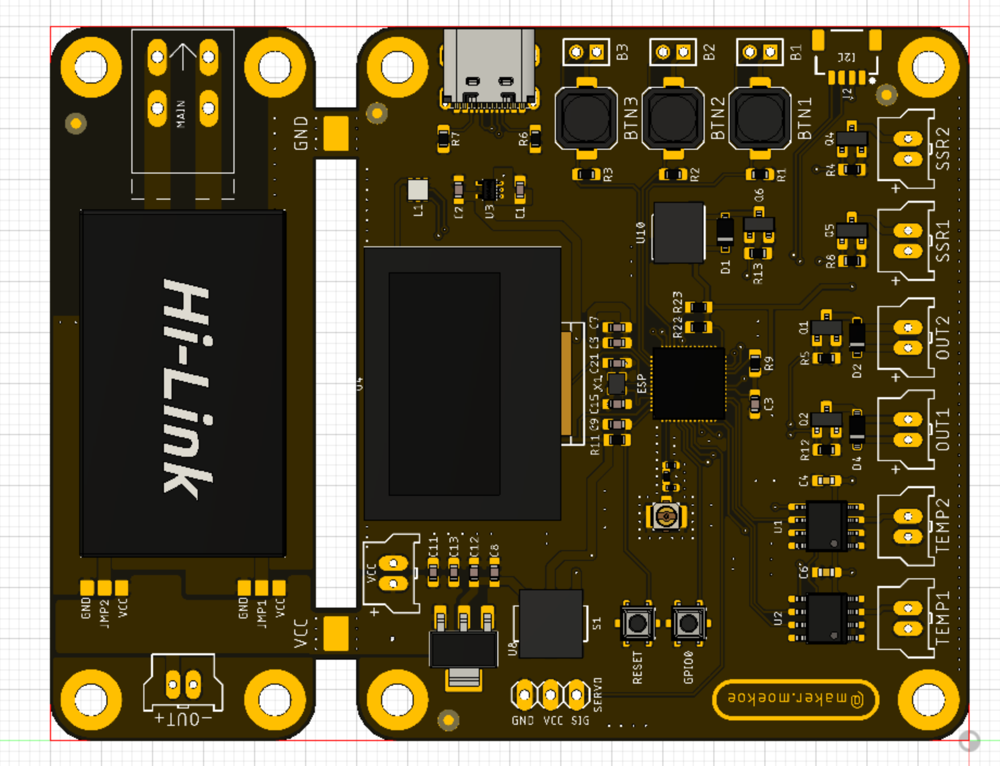
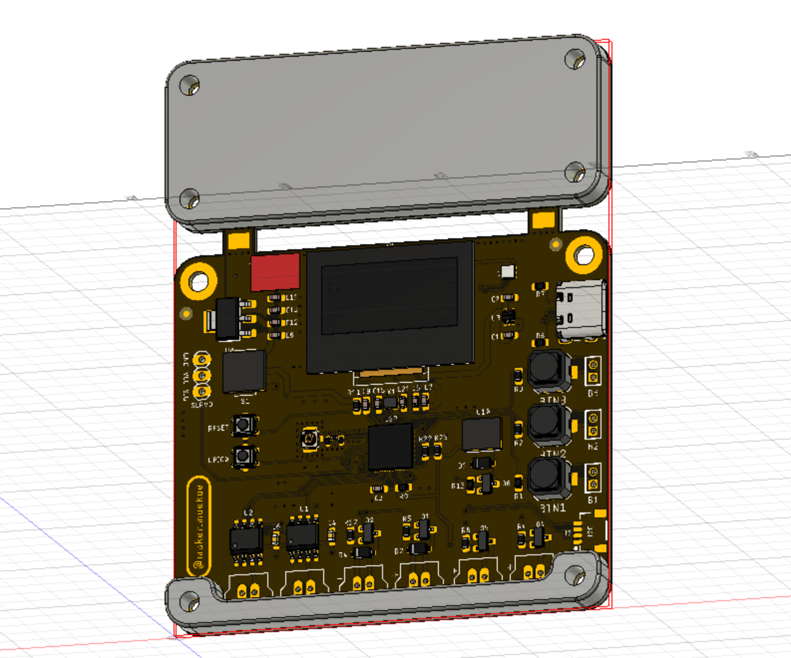
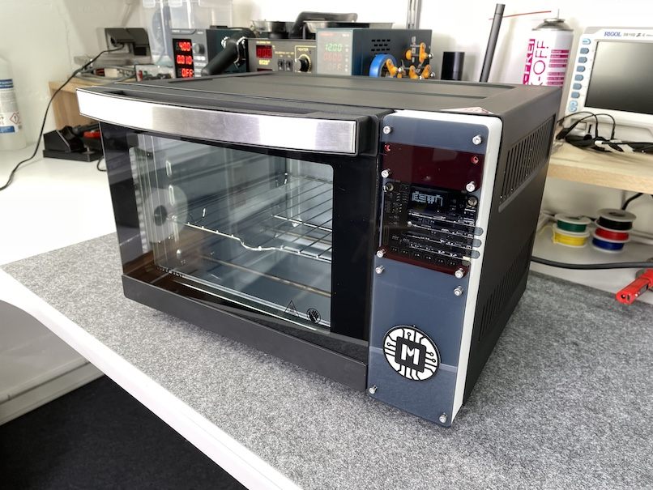
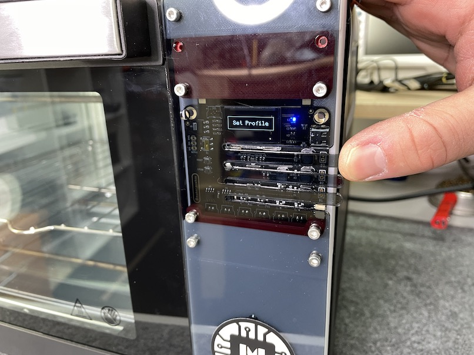

# Reflow-Controller

</a>

The Reflow-Controller was built to control different kinds of reflow ovens, hotplates and whatever is coming to my mind in the future. It is based on the ESP32-S2 ([datasheet](https://www.espressif.com/sites/default/files/documentation/esp32-s2_datasheet_en.pdf)) and thus can be programmed to be used with a WiFi App or whatever. Nevertheless, it has an onboard OLED display and three buttons included to be used as a standalone solution either.

The [Youtube video](https://youtu.be/nffLDqJwJ3Q) shows the assembly of a complete reflow oven system and the first tests.

## Build & flash :
Using Visual Studio : Import "code" folder as project folder. Connect the pcb via usb, put the S1 switch to the lower position, hold and press GPIO0-button while resetting with the reset-button. ESP32 should come up as a serial port device. Select that corresponding port for flashing. Edit platformio.ini file and set the upload_port setting corresponding to your serial port device (COMxx on Windows, /dev/ttyUSBx on linux or /dev/cu.usbmodem01 as stated by makermoekoe (original projects author).
Press compile & upload button.

Using Arduino IDE :
Import main.cpp file contents as a new sketch.
Add "https://raw.githubusercontent.com/espressif/arduino-esp32/gh-pages/package_esp32_dev_index.json" as additional board manager URL in Arduino IDE preferences.
Connect the pcb via usb, put the S1 switch to the lower position, hold and press GPIO0-button while resetting with the reset-button. ESP32 should come up as a serial port device. Select that corresponding port for flashing in Arduino (Port setting where the board selection is also located, in "Tools" - Menu)
Then select ESP32S2-Dev Module as board in Arduino. You can make all ESP32-related flash & chip configs there too. The settings I use are :
-"Use CDC on boot" - Enabled
-"CPU Frequency" - 240MHz
-"Core Debug Level" - Warn

All others left by default / select the ones you think fits best.

Libraries required as dependency for the project in Arduino (as for 2.0.3 version I currently use, install them via Arduino Library Manager) :
- PID by Brett Beauregard - v 1.2.1
- FastLED by Daniel Garcia - v 3.5.0
- U8G2 by Oliver Kraus - v 2.33.15
- MAX6675 Library by Adafruit - v 1.1.0
- Smoothed by Matthew Fryer - v 1.2
- ESPAsync-WifiManager and all it`s dependencies (install via IDE library manager) - https://github.com/khoih-prog/ESPAsync_WiFiManager

Lib-versions are the latest ones when writing this.

## Wifi - Setup :
Wifi will (currently!?) NOT work correctly when the board is powered by USB.
This means, you can flash via USB without external power to the board, but, as the initial wifi-setup is blocking the normal program, you will need to power via external power, to get wifi set up correctly. Once wifi is set up, "normal" program will run as soon as wifi connected.
Make sure to select the default 4MB flash partitioning scheme with SPIFFS when flashing.
Process should be done as follows :
Compile & flash => switch to external power => configure wifi by connecting to the esp32-provided AP => restart board on external. You can and should monitor the serial output via USB for the first startup via serial console anyhow, as it will show you debug info and the default wifi-password for the config ap. The caption page of the AP to do the wifi settings is listening on 192.168.4.1:80 once the AP is up.

## OTA-Flash :
Once the board is connected to wifi, you can flash it over the air from then on. Simply select the network-connection port in Arduino, that should come up a few seconds after the board is powered and connected to wifi. Only downside/bug I found so far, is that often the flashing process in Arduino doesnt get the successful flash response and therefore keeps hanging in flash mechanism - making a restart of the IDE necessary. Apart from that, OTA works fine.

(Note from p1ngb4ck, adding this section : ) At the time of writing this, I did not yet find out, how to make the esptool.py settings in Visual Studio Code to be able to make the ESP32 chip settings (USB-CDC, SPIFFS etc etc). Therefore I currently use Arduino 2.0.3 IDE myself. Visual Studio Code has the advantage though, not to have to download&install dependencies (libraries) manually though. If anybody share some light into how to make these settings correctly in Visual Studio Code - you are mostly welcome to add this info by posting to issues section. TY.

Lots of thanks for this great project to makermoekoe. Please watch his video !!!

## Features of the PCB:

- ESP32-S2 MCU
- 2x MAX6675 thermocouple sensor input
- 2x Fan output (inductive loads/flyback diodes included)
- 2x Solid state relay output
- 3x User button
- 1x APA102 user LED
- 1x Buzzer
- 1x Servo motor output
- 0,96" OLED display
- Optional ACDC converter (HLK-PM05, HLK-PM12) which can be separated if not used
- Optional I2C (QWIIC) connector

## GPIOs

The ESP32-S2 is connected like this:

Function | GPIO | Mode
-------- | -------- | --------
SSR1 | GPIO1 | Output
SSR2 | GPIO2 | Output
Servo | GPIO3 | Output
Fan1 | GPIO5 | Output
Fan2 | GPIO6 | Output
CLK | GPIO7 | SPI
MISO | GPIO9 | SPI
MOSI | GPIO11 | SPI
CS1 | GPIO12 | SPI
CS2 | GPIO13 | SPI
Buzzer | GPIO15 | Output
USB D- | GPIO19 | CDC
USB D+ | GPIO20 | CDC
SDA | GPIO33 | I2C
SCL | GPIO35 | I2C
Button1 | GPIO36 | Input
Button2 | GPIO39 | Input
Button3 | GPIO40 | Input
LED CLK | GPIO37 | LED
LED DATA | GPIO38 | LED
OLED RST | GPIO45 | Output

## ACDC power supply

The upper part of the PCB can be used as a power supply for the whole board as well as the higher voltage outputs (SSRs, Fans). If not used, it can be separated from the main board and may be used in another project where an ACDC adapter is needed.

The main board is equipped with an LM1117 3.3v voltage regulator which can be feed with 15v max. The output voltage of the ACDC power supply is the voltage for the SSR and the fan output channels. If you wanna use a servo motor in your project, make sure that the power supply has the correct voltage for the motor (probably 5v).

The HLK-PMXX module for the upper part of the PCB can be placed in two ways - on the bottom or on the top side. This gives the possibility to mount the whole PCB behind an acrylic glass (or whatever) so that the buttons as well as the OLED display are accessible. The two jumpers can then be used to select which signal is VCC and which one is GND. **Keep in mind that there are high voltage pins on the top side of the PCB when mounting the power supply on the bottom side! I've designed a 3D-printable cover, so that these pins cannot be touched accidentally. (Should be mounted in both cases)**

The board can also be powered via USB-C, but keep in mind that the output channels and the servo motor are not powered in this case (initially it is just available for flashing the board).

## Case & Spacer

As I wanna hide the whole PCB behind an acrylic glass (transparent) I've designed a simple case for the high voltage pins at the top and a spacer at the bottom of the PCB. In the end, the acrylic glass will be laser-cutted with some bridges for the buttons. Distance between PCB and acrylic glass is 5mm.

</a>

## Assembled reflow oven

</a>

</a>
